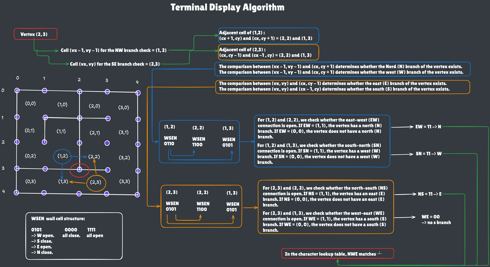

# Description

# Instructions

# Resources

https://www.sdss.org/dr19/tutorials/using_bitmasks/
https://en.wikipedia.org/wiki/Box-drawing_characters#Box_Drawing
https://jrsinclair.com/articles/2025/rendering-mazes-on-the-web/

# visualisation

## Lookup table

La premiere etape consiste a creer une table (ici un dict type) qui fait la correpondance entre la structure du vertex et son caratere. ainsi qu'une fontion guetter qui permet d'interroger la table. Exemple: self.get_char("NEW") -> '┻' \

Pour l'affichage de la maze dans le terminal, il faut changer la perspective. Nous ne premon plus comme reference les cellules de la maze, mais les vertex qui represente les points d'intersection des cellules.
Un vertex est le point de rencontre de 4 cellule.
Le nombre de vertex en largeur est egal à la largeur de maze + 1.
Le nombre de ligne de vertex est egal a la hauteur de maze + 1.

Pour chaque vertex, nous prenons en reference deux cellule opposé en diagonal. Dans l'exemple du vertex 2,3 nous prenon comme reference les cellule 1,2 et 2,3.

La cellule 1,2 nous permettra de determiner l'existance des branches N et W du vertex en verifiant l'existance des murs east et sud de la cellule

La cellule 2,3 nous permettra de determiner l'existance des branches S et E du vertex en verifiant l'existance des murs west et nord

Une fois la structure du vertex etabli, un apelle a la methode get_char de la class Char_set nous permetra d'optenir le charactere du vertex.

Si la coordonee x du vertex est inferieur a la largeur de la maze, et si le vertex a une branche est, une fonction de remplissage est apeller qui ajoute (largeur de cellule -2) le caractere EW.

